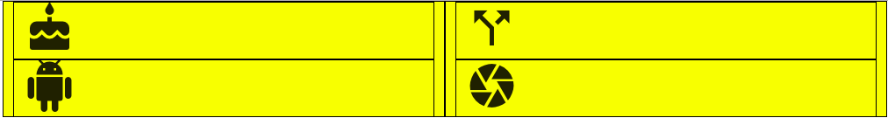
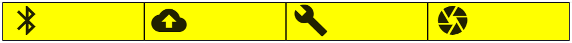
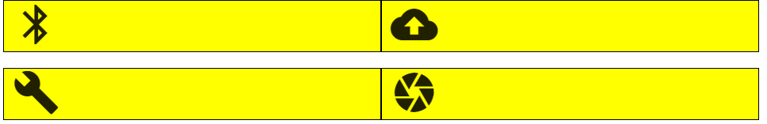
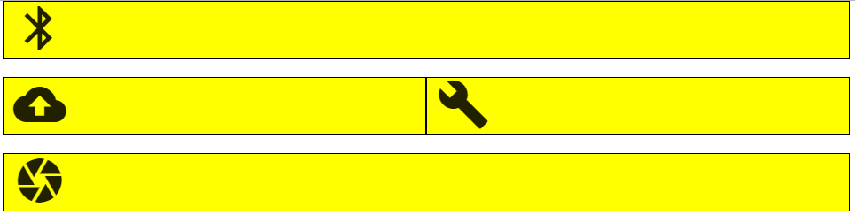
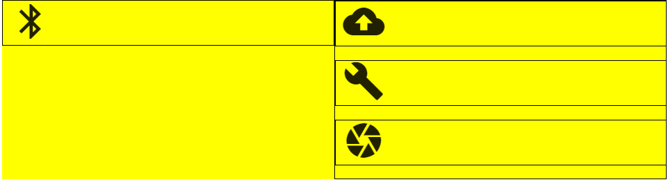
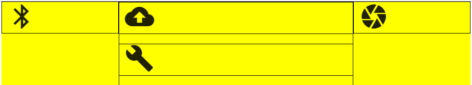

# Bootstrap Nested Grid & Icons Practice

## The Goal
In this lab, you will practice various complex layouts to build up the crucial skill of nesting rows and columns. You'll also gain comfort using Font Awesome Icons, which provide important visual cues to users.

## The Lab
Head to <a href="https://fontawesome.com/icons?d=gallery&m=free">Font Awesome Icons</a> and substitute the four icons in index.html with four of your choosing. Do not change any of the divs, just the `<i>` tags.

* You'll notice that each `<i>` tag has two classes, "fa" and "fa-birthday-cake", for example. To switch an icon, change only what appears after "fa-" in the second class.

For each of the following challenges, you may change any of the row or column divs you see in index.html. Note that white space between rows indicates that there are two separate row divs, and no white space (an entirely yelllow background) indicates that items are in the same row.

### Challenge 1

### Challenge 2

### Challenge 3

### Challenge 4

### Challenge 5

### Stretch
1. Adding as many rows, columns, and icons as you'd like, create your own challenge and swap with a friend!

**SOURCE**: This lab was modified from the original published by [Upperline Code](https://github.com/upperlinecode/bootstrap-grid-icon-practice)
